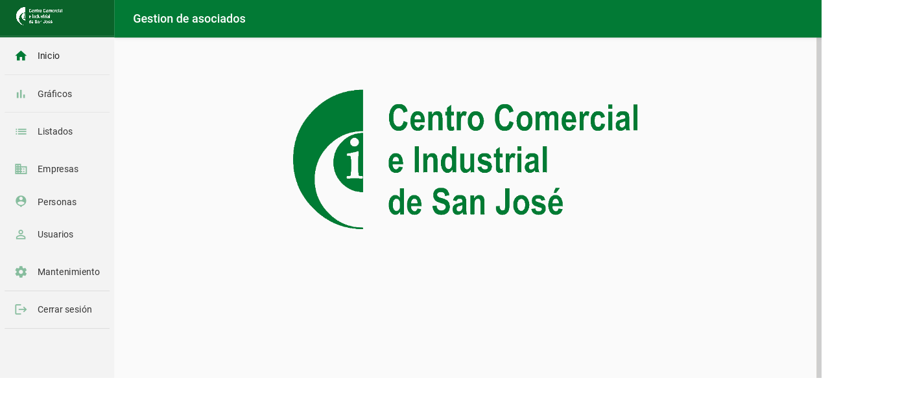
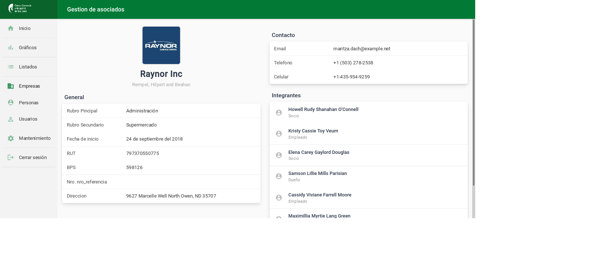
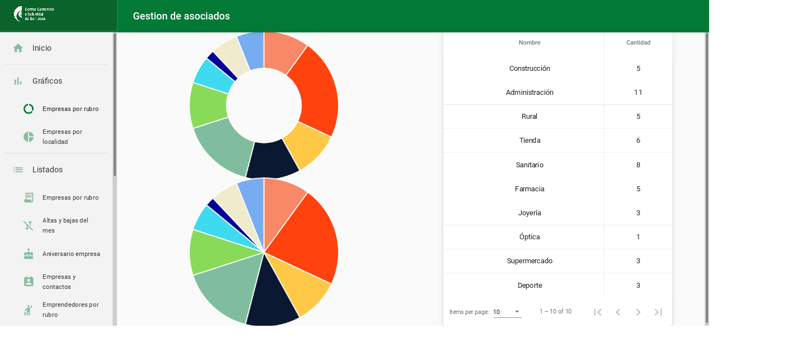
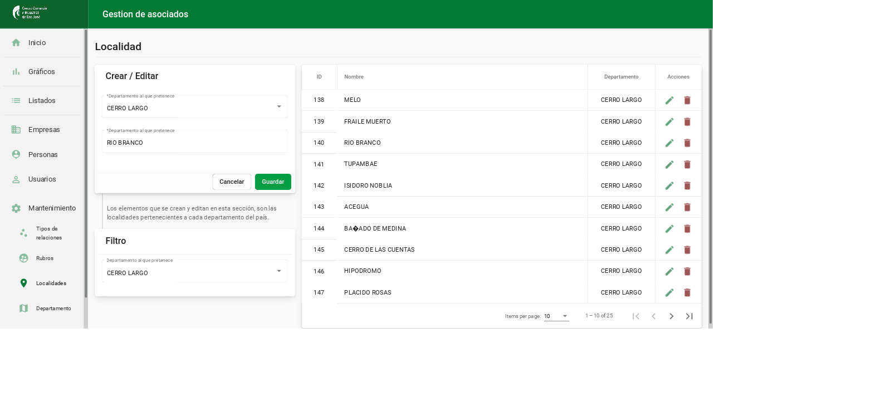

# Desafío Programar

*Desafío Programar* es un proyecto que busca promover el trabajo colaborativo entre estudiantes maragatos, haciendo foco sobre el proceso de trabajo como instancia de aprendizaje, a través del cual puedan ganar experiencia de trabajo, desarrollando requerimientos de clientes reales y conectando con empresas reales.

Podrán participar estudiantes de *UTEC San José*, quienes tendrán como desafio crear en 10 días un producto mínimo viable, el que será evaluado por un jurado y usado por un cliente real.

------------------------------

## Integrantes del equipo

- Sebastián Díaz
- Mauro Pistón
- Juan Álvarez

------------------------------

## Resumen de los requierimientos

Desarrollar una plataforma tecnológica que permita administrar la información de distintas empresas y contactos asociados a cada una de ellas.

Interesa almacenar la información de cada empresa socia de la institución, así como sus personas de contacto y el tipo de relación que mantienen con al misma. Dichas personas pueden poseer un usuario de acceso al sistema el cual les permitirá ver la información de las empresas con las que está relacionada.

Además, los funcionarios de la institución deberán disponer de un usuario que les permita realizar tareas de administración como el registro de nuevas empresas, creación de usuarios, etc.

En el sistema se deberá poder consultar los siguientes reportes:

- Cantidad total de empresa activos
- Cantidad total de empresa por rubro de actividad
- Listado de empresa por rubro de actividad
- Cantidad total de empresa por localidad
- Altas y bajas del Mes
- Aniversario de empresa por mes (fecha de inicio actividad)
- Listado de empresa y sus contactos asociados
- Listado de emprendedores por rubro de actividad

Adicionalmente, se deberá implementar alguna de las siguientes funcionalidades:

- Generar un mecanismo de actualización de datos, donde las empresa/emprendedores puedan entrar al sistema y actualizar sus datos relevantes.
- Generar una herramienta de envío de información relevante a empresa/emprendedores y los contactos asociados (puede ser por email u otros medios, ejemplo: WhatsApp).
- Importación de datos masivo a las entidades (desde Excel). 

Para más información, puede [ver los requerimientos completos](./documentacion/requerimientos.pdf).

------------------------------

## Sistema desarrollado

### Tecnologías utilizadas

El stack tecnológico utilizado para desarrollar este proyecto fue:

- *Angular* como framework para frontend, en conjunto con *Angular Material* como framework CSS.
- *Lumen* como framework para backend, con el cual se implementó una API REST.
- MySQL como manejador de bases de datos.

### Video demostrativo

### Capturas de pantalla

#### Página de inicio de administración

#### Visualización de datos de empresa

#### Gráfica de empresas por departamento

#### Sección de mantenimiento

